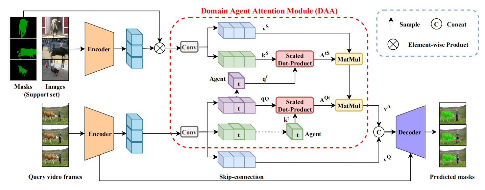

# Domain Agent Network

## Overview

This code is for the paper "Delving Deep into Many-to-many Attention for Few-shot Video Object Segmentation" in CVPR2021.

The architecture of our Domain Agent Network:



## Environment

```sh
git clone git@github.com:TYEclipse/DANet_v2.git
cd DANet_v2
conda create -n DANet_v2 python=3.9
conda activate DANet_v2
conda install pytorch torchvision torchaudio cudatoolkit=10.2 -c pytorch
pip install opencv-python cython easydict imgaug

# https://github.com/youtubevos/cocoapi.git
git clone git@github.com:youtubevos/cocoapi.git
cd cocoapi/PythonAPI
python setup.py build_ext install
```

## Usage

### Preparation

1. Download the 2019 version of [Youtube-VIS](https://youtube-vos.org/dataset/vis/) dataset.
2. Put the dataset in the `./data` folder.

```tree
data
└─ Youtube-VOS
    └─ train
        ├─ Annotations
        ├─ JPEGImages
        └─ train.json
```

1. Install [cocoapi](https://github.com/youtubevos/cocoapi) for Youtube-VIS.
2. Download the ImageNet pretrained [backbone](https://drive.google.com/file/d/1PIMA7uG_fcvXUvjDUL7UIVp6KmGdSFKi/view?usp=sharing) and put it into the `pretrain_model` folder.

```tree
pretrain_model
└─ resnet50_v2.pth
```

1. Update the `root_path` in `config/DAN_config.py`.

### Training

```sh
python train_DAN.py --group 1 --batch_size 4
```

### Inference

You can download our `pretrained` [model](https://drive.google.com/drive/folders/1aJh8awU3X4a_BoIQMOLeqKMlLR8naNFU?usp=sharing) to test.

```sh
python test_DAN.py --test_best --group 1
```

## References

Part of the code is based upon:

+ [Yang-Bob/PMMs](https://github.com/Yang-Bob/PMMs)
+ [Jia-Research-Lab/PFENet](https://github.com/Jia-Research-Lab/PFENet)
+ [lyxok1/STM-Training](https://github.com/lyxok1/STM-Training)
+ [scutpaul/DANet](https://github.com/scutpaul/DANet)
